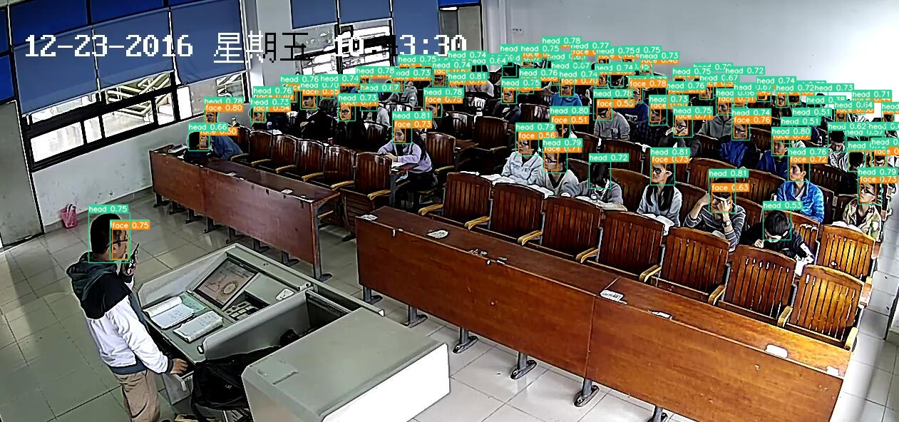

# Head-Face Detection using YOLOv7 Multi-task Learning

## Setup Guide
This guide will walk you through setting up the environment required to run YOLOv7 on a machine with CUDA support.

## Table of Contents

- [Prerequisites](#prerequisites)
- [Environment Setup](#environment-setup)
- [CUDA Installation](#cuda-installation)
- [YOLOv7 Installation](#yolov7-installation)
- [Deploy](Deploy)

## Prerequisites

Before you start, ensure that you have the following:

- A machine with a CUDA-capable GPU.
- `python3.8+` installed.
- Basic knowledge of Python and command-line interface (CLI) operations.

## Environment Setup

1. **Clone the YOLOv7 Repository**

   ```bash
    git clone https://github.com/WongKinYiu/yolov7.git
   
2. **Create a Python Virtual Environment**
It’s recommended to use a virtual environment to avoid conflicts with other projects.
    ```bash
    
    python3 -m venv yolov7-env
    source yolov7-env/bin/activate  # On Windows use yolov7-env\Scripts\activate

3. **Upgrade pip**
    ```bash

    pip install upgrade pip

## NOTICE:

## Please change all line of “matching_matrix = torch.zeros_like(cost, device= device)” and "matching_matrix = torch.zeros_like(cost) into matching_matrix = torch.zeros_like(cost, device= 'cpu') in utils/loss.py to avoid encountering CUDA error

## CUDA Installation
If you don't have CUDA installed, follow these steps:

1. **Check for CUDA Compatibility**

Make sure your GPU is compatible with CUDA by checking [NVIDIA's CUDA GPUs list](https://developer.nvidia.com/cuda-gpus).

2. **Install CUDA Toolkit**

Download and install the appropriate CUDA version from the [NVIDIA CUDA Toolkit.](https://developer.nvidia.com/cuda-toolkit)

Follow the installation instructions provided by NVIDIA for your operating system.

3. **Install cuDNN**

Download cuDNN from the [NVIDIA cuDNN](https://developer.nvidia.com/cudnn) page and follow the installation guide provided for your CUDA version.

4. **Verify CUDA Installation**

After installation, verify that CUDA is properly installed:
    ```bash
    
    nvcc --version
## YOLOv7 Installation
1. **Install Required Python Packages**

Install the dependencies listed in requirements.txt:
      ```bash

      cd yolov7
      pip install -r requirements.txt 

Ensure you have PyTorch installed with CUDA support:
      ```bash

      pip install torch torchvision torchaudio --index-url https://download.pytorch.org/whl/cu118
      
Adjust the PyTorch version and CUDA version (cu118 for CUDA 11.8, etc.) according to your setup.


2. **Weight**
   
   This YOLOv7 was train on [YOLOv7-W6 weight.](https://github.com/WongKinYiu/yolov7/releases/download/v0.1/yolov7-w6.pt)

3. **Dataset**
   
   Click [here.](https://drive.google.com/file/d/1v5DTTaNgrBMtU60AurbUY72o9okU9jxs/view?usp=drive_link) to download.

# Deploy
1. Training

   Open the terminal and type
   
   ```bash
      python yolov7/train_aux.py --batch 16  --cfg ./config.yaml --epochs 60 --data ./data.yaml --hyp ./hyp.yaml --img 640 --weights 'yolov7-w6.pt' --device 0 --entity 'yolov7' --project <project_name> --name <name>

2. Testing
   
   Open the terminal and type

   ```bash
      python yolov7/detect.py --weights <your "best.pt" path you just train> --conf 0.3 --img 1280 --source scut_headface/images/test/

3. Tensorboard
   Open the terminal and type

   ```bash
      cd <project_name>
      tensorboard --logdir ./ --host=127.0.0.1

That is all, thank you for reading
   


   
         
   


    


